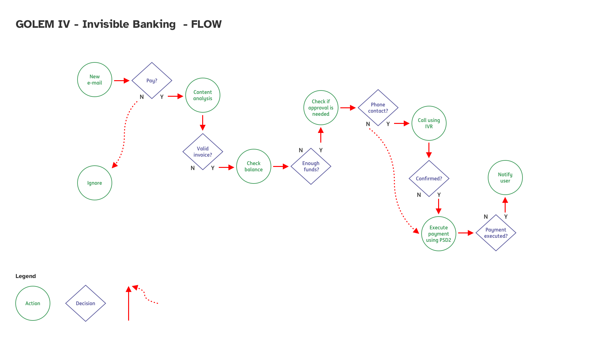

# HACK4LEM

## GOLEM IV - Invisible Banking


### About
- [Presentation](./assets/GOLEM_IV_Invisible_Banking.pdf)

### Ideas

- [Ideation - Creative Process](https://miro.com/app/board/o9J_l-FEkGQ=/)

____

### Architecture




____
### Tech Presentation

https://onedrive.live.com/view.aspx?resid=33DF4C7E7B3968E6!393920&ithint=file%2cpptx&authkey=!APItiviNbUuBgjU
Author: tkopacz
____

### Open Banking (PSD2) Integration

 - integration django backend with simple transaction processing include
   - auth (based on token)
    - bussiness logic (transactions, transfers, amounts, currencies)

- [Open Banking API](https://github.com/tducret/revolut-python/tree/4c58972eb5bcfc16b9ffbdeca8e4c4ce895e84da/revolut_bot)
___

### CyberSecurity

- [OpenId](https://stackoverflow.com/questions/2123369/whats-the-best-solution-for-openid-with-django)

___

### MailHog Instance

https://dockermail.scm.azurewebsites.net/

port 2025 - smtp - (for mail)

port 8025 - html UI

accounts:

____

### Backend Server

```
su:

u: admin
p:Hack4Lem2021


20.56.153.238

u: astrogator
p: Hack4Lem2021

connect: ssh astrogator@20.56.153.238
```

____

### IVR

[Build an IVR with Twilio Studio](https://www.twilio.com/docs/studio/tutorials/how-to-build-an-ivr)

____

### AI/ML Models

- [The Jupyter Notebook](./ML/Hack4Lem.ipynb)
- [ML model in file .h5](./ML/saved_model/hack4lem.h5)
